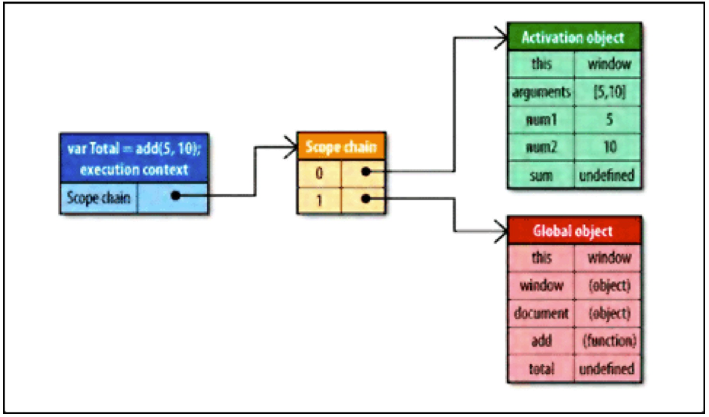

我在重新梳理JS闭包的时候又发现一些概念模糊的地方，在此记录一下我的总结以及引发的思考，方便以后review。讲闭包之前，得先复习下其他几个概念。

### 函数作用域

在一些类似 C 语言的编程语言中，花括号内的每一段代码都具有各自的作用域，而且变量在声明它们的代码段之外是不可见的，我们称为块级作用域（block scope）。而 JavaScript 中没有块级作用域，JavaScript 取而代之地使用了函数作用域（function scope）。比如：

```javascript
function test() {
    console.log(k); // undefined
    for (var k = 0; k < 10; k++) { // k在函数体内是有定义的，不仅仅是在循环内
        console.log(k); 
    }
    console.log(k); // 10
}
```

<!--more-->

- 这跟我们学过的其他的编程语言不太一样，在java中，块级作用域中定义的变量（这里的变量k）只能在块中（这里的for循环体中）使用。
- 因为javascript中变量声明提前的特性，所以变量在声明之前已经是可用的。（这里第一次打印k是undefined）
- 由于 JavaScript 没有块级作用域，因此一些程序员特意将变量声明放在函数体顶部，而不是将声明靠近放在使用变量之处。这种做法使得他们的源代码非常清晰地反映了真实的变量作用域。
- 作用域链：参看下面执行上下文和作用域链

### 自由变量和跨作用域取值

```javascript
var x = 10;
function fn() {
    console.log(x);
}

function test(f){
    var x = 20;
    f();  //10，而不是20
}
test(fn);
```

- 自由变量：函数中局部变量之外的变量（这里的x）。
- 自由变量的跨作用域取值：要到创建这个函数的那个作用域中取值，注意是“创建”，而不是“调用”，其实这就是所谓的“静态作用域”。
- 那么为什么是到创建这个函数的那个作用域中取值呢？且继续往下看。

### 执行上下文

- 执行上下文又叫执行上下文环境、运行期上下文。
- 给执行上下文下一个通俗的定义——在执行代码之前，把将要用到的所有的变量都事先拿出来，有的直接赋值了，有的（普通变量）先用undefined占个空。
- 函数每被调用一次，都会产生一个新的执行上下文。
- 执行上下文栈：处于活动状态的执行上下文只有一个。当函数执行完毕时，执行上下文被销毁，其中的变量也会被同时销毁。但是，如果函数内的变量被一个内部函数所引用并且内部函数将会被调用，那么，这个函数执行完毕时，其执行上下文不会被销毁（因为内部函数需要引用他的变量）。这就是闭包的核心内容。

### 执行上下文和作用域链

- 上面给执行上下文的定义中提到：把将要用到的所有的变量都事先拿出来，那么究竟是怎么拿出来的呢，这就需要用到作用域链。
- 作用域链（scope chain）：每一个Javascript函数都有一个内部属性[[Scope]]，该属性包含一个函数被创建的作用域中对象的集合，此集合被称为函数的作用域链。它决定哪些数据可以由函数访问。此函数中作用域链中每个对象被称为一个可变对象，以“键值对”表示。
- 作用域链的前端，始终都是当前执行的代码所在环境的变量对象。作用域链中的下一个可变对象来自包含（外部）环境，而再下一个可变对象则来自下一个包含环境。这样，一直延续到全局执行环境，所以全局执行环境的变量对象始终都是作用域链中的最后一个对象。比如，当执行了如下代码后：

```javascript
function add(num1, num2){ 
    var sum = num1 + num2; 
    return sum;
}
```

add函数创建后，add函数的作用域链填入了一个可变对象（注意这里只画出全局变量中很少的一部分）。add函数的作用域链将会在运行时用到。

<figure>
	<a href="##"></a>
</figure>

- 一个执行上下文有自己的作用域链。当执行上下文被创建时，它的作用域链被初始化，执行函数的作用域链被复制到执行上下文的作用域链中。并且创建一个被称作“激活对象”的新对象，此激活对象作为一个可变对象，包含了访问所有局部变量，命名参数，参数集合和this的接口。然后，此对象被推入到作用域链的最前端。比如运行add函数时，执行上下文的作用域链如下：

<figure>
	<a href="##"></a>
</figure>

- 执行上下文的作用域链用于解析标识符。在函数运行的过程中，每遇到一个变量，就要进行标识符识别。标识符识别这个过程要决定从哪里获得数据或者存取数据。此过程搜索执行上下文的作用域链，查找同名的标识符。搜索工作从作用域链前端开始，如果找到了，就使用这个具有指定标识符的变量；如果没找到，搜索工作将进入作用域链的下一个对象，此过程持续运行，直到标识符被找到或者没有更多可用对象用于搜索，这种情况视为标识符未定义。所以，访问局部变量总是比访问全局变量快。

### 闭包

- 说完上面的作用域和执行上下文后，就可以来谈谈闭包了。闭包是Javascript最强大的一个方面，它允许函数访问局部范围之外的的数据。而在其他类C语言，函数想要访问局部范围之外的的数据只能通过两种方式，一是传参，二是这个数据是全局的。
- 闭包应用的两个场景——函数作为返回值，函数作为参数传递。

1. 函数作为返回值（计数器）

    ```javascript
    var add = function() {
        var counter = 0;
        var plus = function() {return counter += 1;}
        return plus;
    }

    var puls2 = add();
    console.log(puls2());   //1
    console.log(puls2());   //2
    console.log(puls2());   //3
    ```

    事件也属于第一种情况

    ```javascript
    function fn(){
        var id = "1"; 
        document.getElementById("save-btn").onclick = function(event){
            saveDocument(id); 
        };
    }
    fn();
    ```

2. 函数作为参数被传递

    ```javascript
    var x = 10;
    function fn() {
        console.log(x);
    }

    function test(f){
        var x = 20;
        f();  //10，而不是20
    }
    test(fn);
    ```

    在上面自由变量和跨作用域取值中出现了这个例子，并且引发了疑问，为什么自由变量的跨作用域取值，要到创建这个函数的那个作用域中取值。现在就可以来解答了。

    因为函数fn的作用域链在函数创建时就初始化好了，与在哪里调用并无关系。在test()中调用f()时，遇到标识符x，进行标识符识别。从作用域链前端开始，第一个可变对象就是全局执行环境中的x，所以输出10。

### 使用闭包的注意点

- 由于闭包会使得函数的执行上下文不被销毁，函数中的变量都被保存在内存中，内存消耗很大，所以不能滥用闭包，否则会造成网页的性能问题，在 IE 中可能导致内存泄露。解决方法是，在退出函数之前，将不使用的局部变量全部删除或设置为 null，断开变量和内存的联系。而且，使用闭包你将经常访问一些范围之外的标识符，每次访问都将导致一些性能损失。但是，你可以将常用的域外变量存入局部变量中，然后直接访问局部变量。
- 闭包会在父函数外部，改变父函数内部变量的值。所以，如果你把父函数当作对象（object）使用，把闭包当作它的公用方法（public method），把内部变量当作它的私有属性（private value），这时一定要小心，不要随便改变父函数内部变量的值。

JavaScript 闭包是一种强大的语言特性。通过使用这个语言特性来隐藏变量，可以避免覆盖其他地方使用的同名变量，理解闭包有助于编写出更有效也更简洁的代码。

### JS面试题

下面是在博客园看到的两道经典的JS面试题，有助于理解JS基础知识。

```javascript
function Foo() {
    getName = function () { alert (1); };
    return this;
}
Foo.getName = function () { alert (2);};
Foo.prototype.getName = function () { alert (3);};
var getName = function () { alert (4);};
function getName() { alert (5);}

//请写出以下输出结果：
Foo.getName();
getName();
Foo().getName();
getName();
new Foo.getName();
new Foo().getName();
new new Foo().getName();
```

原文链接

[一道常被人轻视的前端JS面试题](http://www.cnblogs.com/xxcanghai/p/5189353.html)

```javascript
function fun(n,o) {
  console.log(o)
  return {
    fun:function(m){
      return fun(m,n);
    }
  };
}
var a = fun(0);  a.fun(1);  a.fun(2);  a.fun(3);//undefined,?,?,?
var b = fun(0).fun(1).fun(2).fun(3);//undefined,?,?,?
var c = fun(0).fun(1);  c.fun(2);  c.fun(3);//undefined,?,?,?
//问:三行a,b,c的输出分别是什么？
```

原文链接

[大部分人都会做错的经典JS闭包面试题](http://www.cnblogs.com/xxcanghai/p/4991870.html)

此文参考：

[《JavaScript 闯关记》之作用域和闭包](http://shijiajie.com/2016/12/13/javascript-lesson-2.4-Scope&Closure/)

[深入理解javascript原型和闭包](http://www.cnblogs.com/wangfupeng1988/p/3977924.html)

[高性能Javascript--高效的数据访问](http://www.cnblogs.com/coco1s/p/4017544.html)